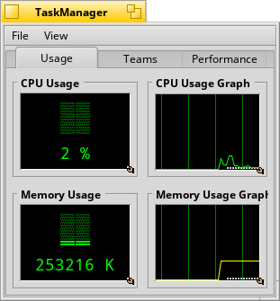

TaskManager
==

Be TaskManager displays all relevant system information in three tabs in its main window. These are:

  - The Usage tab: Displays general system information like memory and CPU usage.
  - The Process tab: Displays all runnig processes (teams) in your system, their memory and CPU usage, team id etc. You can quit teams, kill them and change their priority.
  - The Performance tab: This is a configurable graphical display for various system information including your motherboard temperature (X86 version only, only available if you have a LM78 motherboard sensor installed).

Available on HaikuWare: http://haikuware.com/directory/view-details/utilities/system-system-information/be-taskmanager
